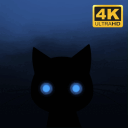

# StalkerCat+ Live Wallpaper

A beautiful dark interactive scene-based live wallpaper for Wallpaper Engine.

**Steam workshop link**: https://steamcommunity.com/sharedfiles/filedetails/?id=3350454609

## Description

Add a playful feline to your desktop or home screen with this sneaky cat live wallpaper. He quietly appears from random spots along the edges of your screen, giving a smug look when he thinks he’s gone unnoticed. With captivating eyes and rich colors, this subtle yet enchanting dark wallpaper adds charm to your device.

---

Port of the Android Stalker Cat live wallpaper to Wallpaper Engine.

This is a scene-based wallpaper written in SceneScript.

## Features

This version supports all the features of the original, including iteration and individual color customization:

- Dynamic resolution (Cat size and background adapt to your screen's aspect ratio without cropping, whether in landscape or portrait mode)
- PC and mobile support (Android and iOS)
- Interactive (Click/Tap to hide - can be disabled in the settings)
- Individual color customization for all elements (background, cat body, cat eyes)
- Customizable cat linger time (Skittish, Mildly interested, Very interested)

## Credits

- Creators of the original version: Anne Pätzke, Winterlight.
- Upscale and logic (SceneScript): by me.
